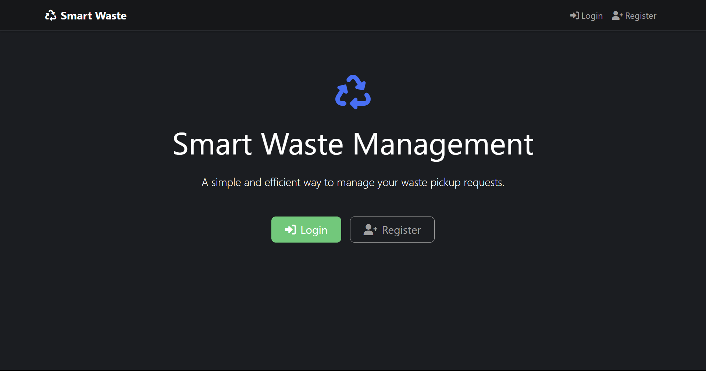
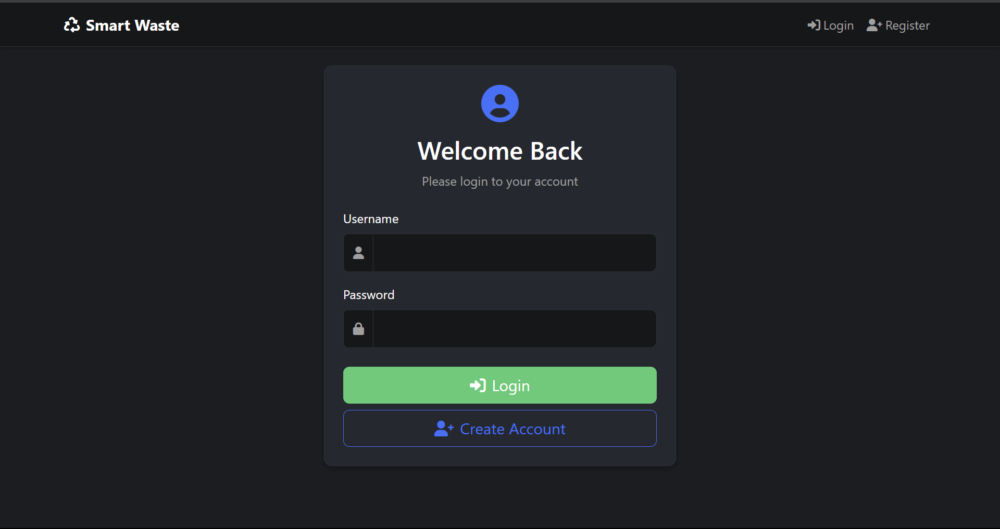
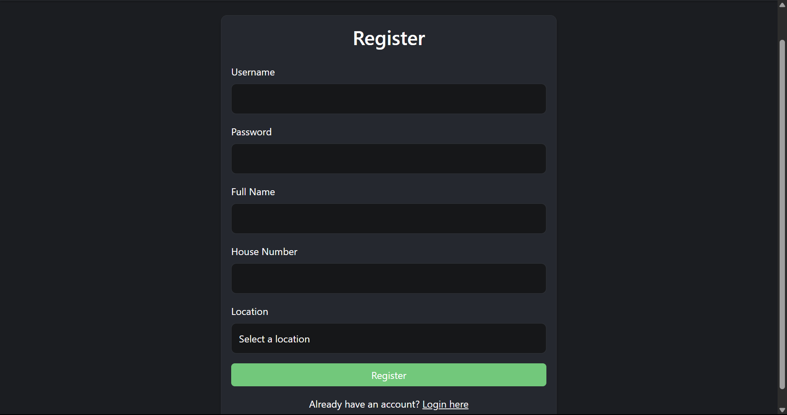
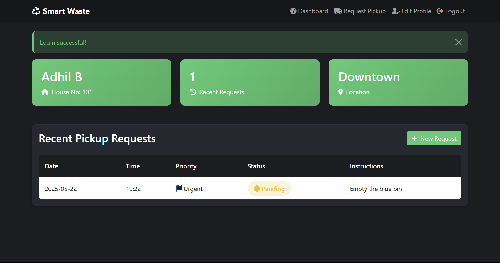
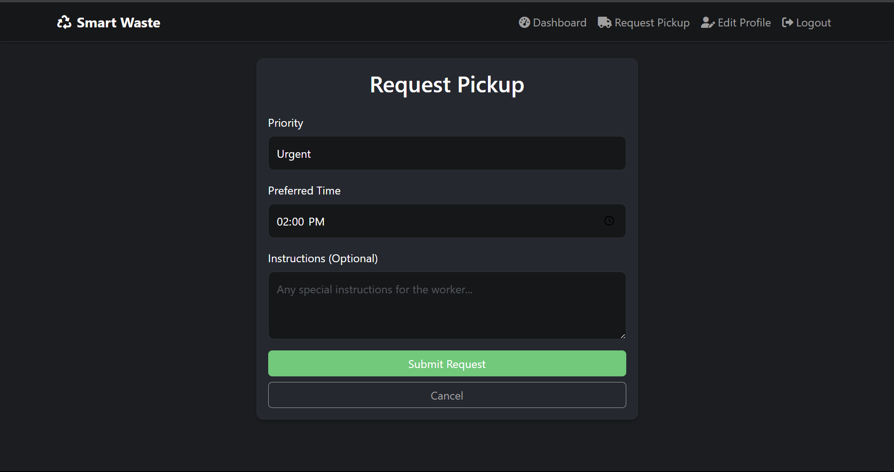
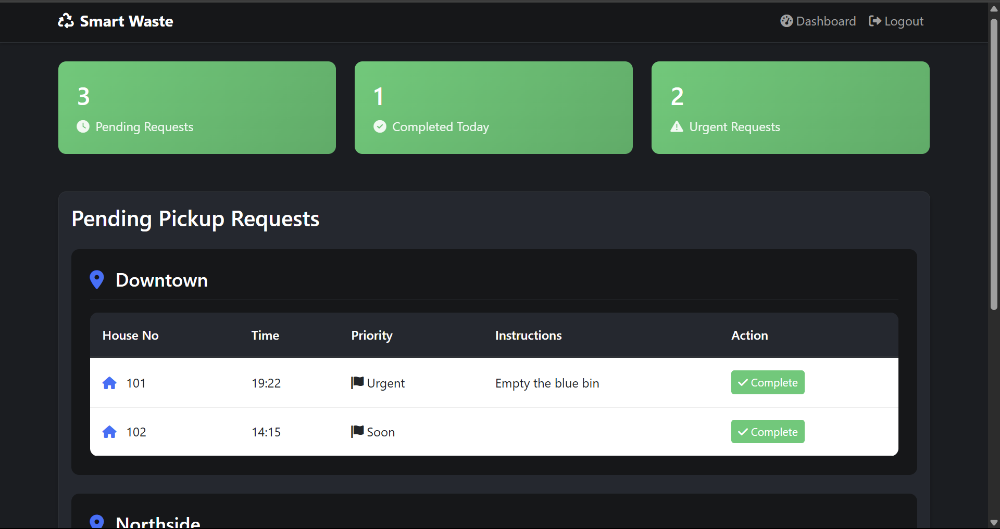

# Smart Waste Management System

A modern, user-friendly web application for managing and optimizing waste pickup requests in urban areas. Built with Flask, MySQL, and Bootstrap, this system streamlines the process for both residents and waste collection workers.

## Table of Contents
- [Overview](#overview)
- [Features](#features)
- [System Functions & Routes](#system-functions--routes)
- [Setup Instructions](#setup-instructions)
- [Configuration](#configuration)
- [Usage Guide](#usage-guide)
- [Troubleshooting](#troubleshooting)

---

## Overview
This project provides a platform for:
- Residents to request waste pickups, track their status, and manage their profiles.
- Workers to view, manage, and complete pickup requests efficiently.

The system is ideal for municipalities, gated communities, or any organization looking to digitize and optimize waste collection.

## Screenshots


<details>
  <summary>View More Screenshots (Click to Expand)</summary>

  ### Login Page

  

  ### Registation Page

  

  ### User Dashboard

  

  ### Pickup Request

  

  ### Worker Dashboard

  

</details>

## Features
- **User Registration & Login:** Residents can create accounts and securely log in.
- **Worker Login:** Special accounts for waste collection workers.
- **Request Waste Pickup:** Residents can submit pickup requests, set priority, preferred time, and add instructions.
- **Track Pickup Status:** Users can view the status and history of their requests.
- **Worker Dashboard:** Workers see pending and completed pickups, and can mark requests as completed.
- **Profile Management:** Users can update their personal and address information.
- **Location Management:** Predefined locations for easy request categorization.

## System Functions & Routes
- `/` : Home page with introduction and navigation.
- `/register` : User registration form (GET/POST).
- `/login` : Login for both users and workers (GET/POST).
- `/dashboard` :
  - For users: View profile and recent pickup requests.
  - For workers: View all pending and completed pickup requests.
- `/request_pickup` : Users submit new pickup requests (GET/POST).
- `/complete_pickup/<request_id>` : Workers mark a pickup as completed (POST).
- `/edit_profile` : Users update their profile information (GET/POST).
- `/logout` : Log out of the system.

### Database Initialization
- `init_db.py` : Script to create the database, tables, and insert sample data (including a default worker account).

## Setup Instructions

### 1. Clone the Repository
```
git clone <your-repo-url>
cd Smart-Waste-Collection
```

### 2. Install Python Dependencies
```
pip install -r requirements.txt
```

### 3. Configure Environment Variables
Create a `.env` file in the project root with your database credentials:
```
DB_HOST=localhost
DB_USER=your_mysql_username
DB_PASSWORD=your_mysql_password
DB_NAME=smart_waste_db
SECRET_KEY=your_secret_key
```

### 4. Initialize the Database
Run the following command to set up the database and tables:
```
python init_db.py
```
This will create the necessary tables and insert sample locations and a worker account (username: `worker1`, password: `4321`).

### 5. Run the Application
```
python app.py
```
The app will be available at `http://127.0.0.1:5000/`.

## Configuration
- All configuration is managed via the `.env` file and `config.py`.
- The app uses Flask-Login for authentication and MySQL for data storage.
- All dependencies are listed in `requirements.txt`.

## Usage Guide
### For Residents (Users):
1. Register a new account with your details and select your location.
2. Log in and access your dashboard.
3. Submit a new waste pickup request via the "Request Pickup" page.
4. Track the status of your requests on your dashboard.
5. Edit your profile as needed.

### For Workers:
1. Log in using the provided worker credentials (or as set by the admin).
2. Access the worker dashboard to view all pending pickup requests.
3. Mark requests as completed after collection.
4. View history of completed pickups.

## Troubleshooting
- **Database connection errors:** Ensure MySQL is running and credentials in `.env` are correct.
- **Port already in use:** Change the port in `app.py` if needed.
- **Missing dependencies:** Run `pip install -r requirements.txt` again.

---

For further questions or contributions, please open an issue or pull request! 